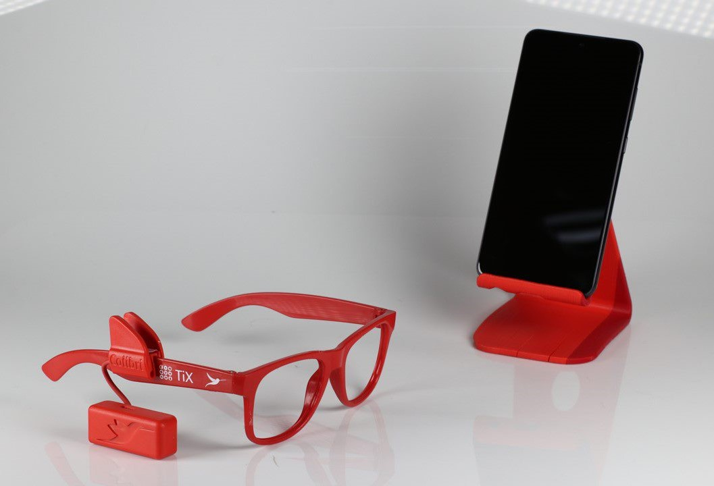
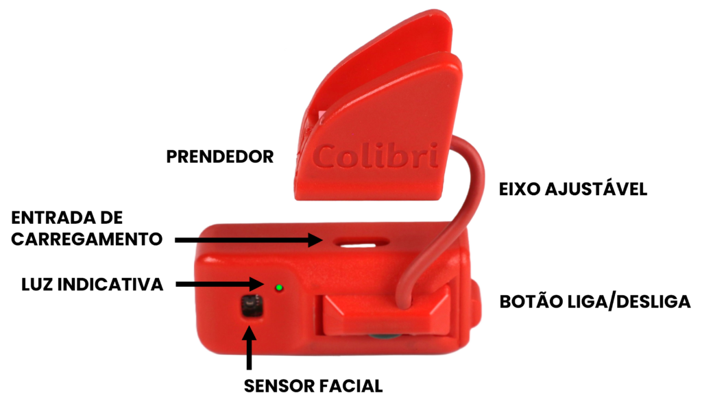

# 🐦 Pesquisa sobre o Voa Colibri
O Voa Colibri é um dispositivo inovador que permite o controle de computadores e celulares através de movimentos da cabeça, facilitando a vida de pessoas com deficiências motoras. Este dispositivo é ajustável, sem fios, e possui uma bateria de longa duração. É indicado para indivíduos com condições como tetraplegia, esclerose lateral amiotrófica e paralisia cerebral, oferecendo diversas opções de uso, como cliques por gestos faciais e navegação com inclinações de cabeça. Além disso, o Colibri é fácil de usar, não requer instalação de software e pode ser adaptado para diferentes acessórios de cabeça. O documento também inclui informações sobre preços, links importantes e perguntas frequentes sobre o uso do aparelho.

## 📑 Sumário
1. [🤔 O que é?](#-o-que-é)
2. [👥 Para quem é indicado?](#-para-quem-é-indicado)
3. [⚙️ Como utilizar?](#-como-utilizar)
4. [🌐 Links Importantes](#-links-importantes)
5. [💲 Preços](#-preços)
6. [❓ Perguntas Frequentes](#-perguntas-frequentes)
7. [📞 Contatos](#-contatos)

## 1. 🤔 O que é?
O Colibri é um dispositivo de controle de computador ou celular por movimentos da cabeça.  
Ele capta os movimentos da cabeça para controlar o cursor do mouse com precisão. Os cliques podem ser feitos com o piscar, com o sorriso ou automaticamente após a parada do ponteiro.  
Seu funcionamento pode ser ajustado de acordo com as características de movimento de cada pessoa, por meio de um aplicativo opcional de personalização.  
O Colibri tem diversas cores, é leve, sem fios, tem bateria recarregável com 30 horas de autonomia e pode ser fixado a qualquer armação de óculos.  
O aparelho é capaz de se conectar sem fios a computadores, smartphones ou tablets com Bluetooth, sem precisar instalar nada.

- [🎥 Demonstração de uso do Voa Colibri com Lais Souza](https://youtu.be/FYnEm51OlDg)
- [📖 Tutorial de uso do Voa Colibri](https://youtu.be/eBz6on0es1k)

## 2. 👥 Para quem é indicado?
Com o Colibri, pessoas com deficiências motoras usam celulares e computadores com movimentos da cabeça. Indicado para:
- 🧑‍🦽 Tetraplegia e lesão medular
- 🦸‍♂️ Atrofia Muscular Espinhal
- 🧑‍🦲 Esclerose Lateral Amiotrófica
- 🦵 Malformação ou amputações
- 🧑‍🦼 Paralisia Cerebral
- 🧑‍⚕️ Sequelas de AVC  
O Colibri é destinado a qualquer pessoa com limitações do movimento das mãos, desde que preserve nível cognitivo adequado e bom controle voluntário dos movimentos da cabeça.

## 3. ⚙️ Como utilizar?
- 🔋 **CARREGAMENTO:** Mantenha sua bateria carregada e use o dia inteiro sem preocupações, pois a bateria recarregável permite até 30h de uso contínuo.
- 👓 **VESTINDO O COLIBRI:** Prenda o Colibri na haste dos óculos com a presilha e ajuste o posicionamento com a haste flexível. A seta deve sempre apontar para frente.
- 📶 **PAREAMENTO BLUETOOTH:** Busque o Colibri pelo menu de configuração Bluetooth do seu aparelho e clique em parear para estabelecer a conexão.
- 🖱️ **MOVIMENTAÇÃO DO CURSOR:** Aprenda os melhores movimentos para colocar o cursor em qualquer lugar da tela com velocidade e precisão.
- 🖱️ **OPÇÕES DE CLIQUE:** Escolha a melhor forma de clicar: o clique automático é fácil e simples para começar, mas o clique ativado por gestos faciais permite ações mais complexas.
- 📜 **ROLAGEM DE TELA:** Navegue por feeds e listas com agilidade utilizando a rolagem (scroll) com o gesto de inclinar a cabeça lentamente na direção dos ombros direito ou esquerdo.
- 🛑 **SUSPENSÃO:** Não precisamos controlar o mouse o tempo todo, certo? Sem problemas: desative e reative o Colibri só com movimentos de cabeça em sinal de NÃO e SIM.
- 👍 **CLIQUE DIREITO:** Aprenda a ativar a função de clique do botão direito do mouse com o gesto de balançar a cabeça em sinal afirmativo (SIM).
- ⚙️ **AJUSTES AVANÇADOS:** Acesse mais configurações. Algumas pessoas precisam de ajustes especiais para melhor aproveitamento dos movimentos disponíveis.

## 4. 🌐 Links Importantes
- [🌍 Site Oficial](https://voacolibri.com.br/)
- [🔓 Open-Source do Colibri](https://github.com/tix-life/Colibrino)
- [📱 Aplicativo My Colibri](https://mycolibri.app/home)

## 5. 💲 Preços

## 6. ❓ Perguntas Frequentes
| **Pergunta** | **Resposta** |
|--------------|--------------|
| **O Colibri funciona pelo olhar?** | Não. O Colibri move o ponteiro do mouse pelos movimentos da cabeça. No entanto, o Colibri pode captar a piscada dos olhos e outros pequenos movimentos faciais para fazer os cliques. |
| **Tenho pouco movimento de cabeça, posso usar o Colibri?** | O Colibri é capaz de se adaptar a movimentos de cabeça bem sutis, desde que a pessoa tenha um bom controle desses movimentos. Mesmo sem movimento de cabeça, o Colibri pode ser usado para cliques com pequenos movimentos faciais ou manuais. |
| **Como faço os cliques usando o Colibri?** | O clique pode ser feito por tempo ou por gesto facial. Clique por tempo acontece automaticamente ao parar o cursor sobre um alvo. Clique por gesto facial detecta movimentos como piscadas ou sorrisos. A escolha é feita no aplicativo [My Colibri](https://mycolibri.app/home). |
| **Tenho dificuldades em piscar os olhos, posso usar o Colibri?** | Sim. O clique do mouse pode ser feito automaticamente quando o cursor permanecer parado sobre um alvo por um curto período. |
| **Tenho movimentos involuntários com a cabeça, posso usar o Colibri?** | O Colibri filtra alguns movimentos involuntários, mas pode ser adaptado para outros tipos de uso, mesmo em casos de movimentos bastante involuntários. Nossa equipe pode avaliar remotamente para melhor adaptação. |
| **Tenho que instalar programas ou aplicativos para usar o Colibri?** | O Colibri funciona em dispositivos com Bluetooth, sem necessidade de instalação. Para personalizar configurações, use o aplicativo [My Colibri](https://mycolibri.app/home). |
| **Não uso óculos, como vou usar o Colibri?** | Quem não usa óculos pode utilizar a armação sem lentes que acompanha o Colibri ou qualquer outra armação de preferência. Usuários de óculos de grau podem montar o Colibri diretamente na própria armação. |
| **Uso óculos de grau, como vou usar o Colibri?** | Basta prender o Colibri à haste da sua armação com o prendedor acoplado ao aparelho. Se não usar óculos, pode-se utilizar a armação sem lentes que acompanha o Colibri. |
| **Posso usar o Colibri em um boné ou outro acessório sem ser óculos?** | Sim. O Colibri pode ser preso em boné, tiara, headset ou outros acessórios de cabeça. A presilha permite o ajuste adequado, garantindo que o aparelho fique alinhado para captar corretamente os movimentos. |
| **O Colibri só pode ser posicionado do lado direito da cabeça?** | O Colibri pode ser usado em qualquer lado dos óculos ou acessório de cabeça. O importante é que a seta na parte inferior do Colibri esteja apontando para frente, alinhada com o nariz. Independente de estar preso nos óculos ou em outro acessório de cabeça, como um boné ou tiara de cabelo, o importante é garantir que o aparelho esteja posicionado na direção correta da cabeça, de forma que os movimentos do mouse sejam coerentes. Para isso, certifique-se que o desenho da seta presente na parte inferior Colibri esteja apontando para frente (ou seja, na mesma direção em que o nariz da pessoa utilizadora) após posicioná-lo no acessório de cabeça escolhido. |
| **É preciso ser alfabetizado para usar o Colibri?** | Não. O Colibri funciona como um mouse convencional, controlado pelos movimentos de cabeça. |
| **Posso experimentar antes de decidir?** | Sim. O Colibri é oferecido por assinatura com valor mensal acessível, podendo ser cancelada a qualquer momento sem multa. |
| **Tem multa se eu cancelar a assinatura do Colibri?** | Não há multa. A assinatura pode ser cancelada a partir do primeiro mês, mediante devolução do equipamento. |
| **Qual é o prazo de garantia do Colibri?** | O Colibri tem garantia de 3 anos contra defeitos de fabricação. |
| **O Colibri funciona no iPhone?** | Sim, o Colibri funciona com iPhone e iPad desde que o iOS ou iPadOS seja versão 13.4 ou superior. Após o pareamento Bluetooth, ative o AssistiveTouch nas configurações de acessibilidade (Ajustes > Acessibilidade > Toque > AssistiveTouch). |

[Todas as Perguntas e Respostas, não resumidas, disponíveis aqui!](https://voacolibri.com.br/perguntas-frequentes/)

## 7. 📞 Contatos
Rua Bento Mendes Castanheira, 31, 2.⁰ andar - Dona Clara  
Belo Horizonte, MG - Brasil, 31260-270  
[🌐 Site: voacolibri.com.br](https://voacolibri.com.br/)  
[📞 Telefone Fixo: 31 3495-1497](tel:553134951497)  
[💬 WhatsApp: 31 97349-4143](https://wa.me/5531973494143)  
[✉️ Email: colibri@voacolibri.com.br](mailto:colibri@voacolibri.com.br)  
[🔗 LinkedIn: Colibri Interfaces](https://www.linkedin.com/company/colibri-interfaces/)  
[📸 Instagram: @voa.colibri](https://www.instagram.com/voa.colibri/)  
[📘 Facebook: Tix Startup](https://www.facebook.com/tixstartup)  

---